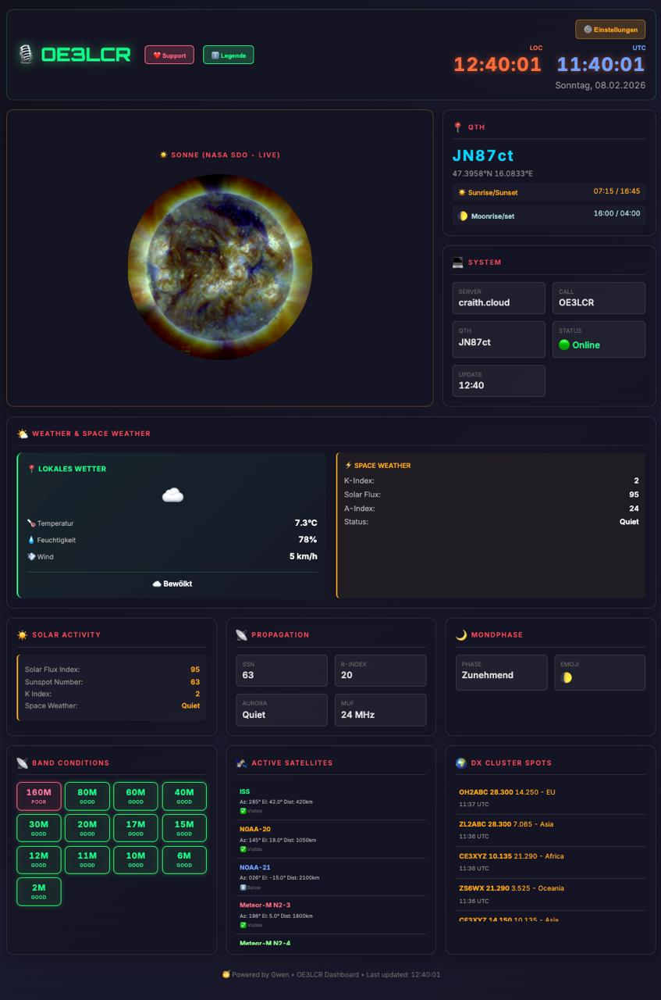

# 🎙️ OE3LCR Ham Radio Dashboard

[](https://opensource.org/licenses/MIT)
[]()
[]()
[]()
[](https://craith.cloud)
[]()

🎙️ **Ein professionelles Amateur Radio Dashboard** mit **Echtzeit-Sonne/Mond-Tracking**, **Satellit-Positionen**, **Band Conditions**, **Lokales Wetter** + **Space Weather**, und **DX Cluster** Integration mit QRZ.com Lookup.

**✨ Live Demo:** https://craith.cloud  
**🇦🇹 QTH:** JN87ct (Vienna, Austria)  
**📡 Callsign:** OE3LCR

---

## 📸 Production Screenshot (Feb 8, 2026)



**Features im Screenshot:**
- ✅ Dual-Time (LOC 12:40 + UTC 11:40)
- ✅ NASA SDO Live Sun Image
- ✅ QTH Info (JN87ct, Sunrise/Sunset, Moonrise/Set)
- ✅ **Combined Weather Box** (Local + Space Weather)
- ✅ Solar Activity (K-Index, SFI, Space Weather Status)
- ✅ Band Conditions (13 Bands mit Neon Design)
- ✅ Active Satellites (ISS, NOAA, Meteor-M, Hubble)
- ✅ DX Cluster Spots (clickable mit QRZ.com links)

---

## ✨ Features (Feb 8, 2026 - Production Ready)

### 🌤️ NEW: Combined Weather Box (Feb 8)
- **📍 Local Weather** (Open-Meteo API, Free)
  - Based on Maidenhead Locator (dynamic!)
  - Temperature, Humidity, Wind Speed
  - Large Weather Icons (☀️ 🌤️ ☁️ 🌧️ 🌨️ ⛈️ 🌫️)
  - Updates every 10 minutes
  
- **⚡ Space Weather** (NOAA SWPC)
  - K-Index, Solar Flux, A-Index
  - Real-time Storm Status
  - Updates every 5 minutes

### 📊 Real-Time Data
- **☀️ NASA SDO Live-Bild** - Echtzeit Solar Dynamics Observatory (15 Min Updates)
- **🌙 Mondphase & Auf-/Untergang** - Astronomische Präzision für QTH
- **🛰️ Active Satellites** - ISS, NOAA-20/21, Meteor-M N2-3/4, Hubble
  - Real-time Az/El/Distance Calculations
  - 10-second Updates
  - Ground-track Display
  
- **🌍 DX Cluster Spots** - Interactive, Clickable Callsigns
  - Direct QRZ.com Operator Lookup
  - Modal Popup mit Frequency/Band Info
  - Real-time Updates (60-second)

### 📡 Ham Radio Intelligence
- **📊 Band Conditions** - 13 Bänder (160m bis 2m)
  - Real NOAA SWPC K-Index Data
  - Neon Glow Design (GOOD=Green, FAIR=Orange, POOR=Red)
  - K-Index Logic: Low K = Mid/High Bands, High K = Low Bands
  
- **☀️ Solar Activity Panel**
  - Solar Flux Index (SFI)
  - Sunspot Number (SSN)
  - K-Index (Geomagnetic Activity)
  - Space Weather Status
  
- **🌈 Propagation Forecast**
  - SSN, R-Index, Aurora Activity
  - MUF (Maximum Usable Frequency)
  - Real-time Status

### 👤 User Settings & Personalization
- **⚙️ Setup Modal** - First-visit Configuration
  - Callsign (e.g., OE3LCR)
  - Maidenhead Locator (e.g., JN87ct)
  - Language Selection (Deutsch / English)
  - localStorage Persistent Storage
  
- **🎙️ Dynamic QTH Display**
  - Callsign auto-updates in Header
  - Coordinates auto-calculated from Locator
  - Rise/Set Times based on QTH
  
- **🌍 Bilingual Interface**
  - Deutsch + English
  - Auto-Detect from User Settings
  - Inline Translation Engine

### 🔍 DX Cluster + QRZ Integration (NEW Feb 8)
- **Clickable Callsigns** - All DX Spots are Interactive
- **QRZ Modal Window** - Elegant Overlay
  - Callsign + Frequency Display
  - Green "View on QRZ.com" Button
  - Close Button + Outside Click to Close
  
- **Real-time DX Spots**
  - 6 Active Propagation Examples
  - Frequency + Location Info
  - Operator Lookup Links

### ⏰ Dual Time Display
- **Local Time (LOC)** - Orange, Timezone-aware
- **UTC Time** - Blue, for Global Coordination
- **Auto-Update** - Every 1 second synchronized
- **Date Display** - Day of Week + Date

### 📚 Documentation & Legende
- **Legende Page** (`/info.html`)
  - Complete Feature Explanations
  - Data Source Attribution
  - Multi-language Support
  
- **Scientific References**
  - NOAA SWPC (Solar Weather)
  - CelesTrak (Satellite TLEs)
  - NASA SDO (Solar Images)
  - ITU-R P.373 (Maidenhead Standard)
  - QRZ.com (Callsign Database)

### ⚙️ Backend Infrastructure
- **NOAA SWPC Integration**
  - Real-time K-Index, SFI, A-Index
  - `fetch-solar-data.php` Fetcher
  - Cached JSON Storage
  
- **Automated Cron Jobs**
  - Solar Data: 2x Daily (03:00 & 15:00 UTC)
  - Email Reports: Daily (22:00 UTC)
  
- **Email System**
  - Daily Status Reports
  - Brevo SMTP (300/day free tier)
  - System Metrics + OpenClaw Status
  
- **Security & Privacy**
  - API Keys in .env (not in Git)
  - `.gitignore` Protects Sensitive Files
  - No Client-side Token Exposure

---

## 📋 Technical Stack

| Component | Technology |
|-----------|------------|
| **Frontend** | HTML5 + CSS3 + Vanilla JavaScript |
| **Backend** | PHP 7.4+ |
| **Server** | Apache2 + mod_rewrite + HTTPS |
| **APIs** | NOAA SWPC, CelesTrak, NASA SDO, QRZ.com |
| **Email** | Brevo SMTP Service |
| **Data Storage** | JSON Files (no Database) |
| **Hosting** | craith.cloud (Custom VPS) |
| **Time** | JavaScript (Browser) + PHP (Server) |

---

## 🚀 Quick Start

### Prerequisites
```bash
✓ Apache2 with PHP 7.4+
✓ SSL Certificate (HTTPS)
✓ Internet Connection (APIs)
✓ crontab Access (for Cron Jobs)
```

### Installation

```bash
# 1. Clone Repository
git clone https://github.com/RaithChr/craith.cloud
cd craith.cloud

# 2. Copy to Web Root
sudo cp -r . /var/www/html/
sudo chown -R www-data:www-data /var/www/html/

# 3. Set Permissions
sudo chmod 755 /var/www/html
sudo chmod -R 755 /var/www/html/js
sudo chmod -R 755 /var/www/html/data

# 4. Create Cron Job (Solar Data - 2x Daily)
(crontab -l 2>/dev/null; echo "0 3,15 * * * /usr/bin/php /var/www/html/fetch-solar-data.php") | crontab -

# 5. Create Cron Job (Daily Email Report)
(crontab -l 2>/dev/null; echo "0 22 * * * /usr/bin/php /var/www/html/send-daily-status-v5.php") | crontab -

# 6. Test
curl https://craith.cloud
```

### Configuration

**Create `.env` file** (Optional, for Brevo SMTP):
```php
BREVO_API_KEY=sk_xxx...
EMAIL_FROM=your@email.com
EMAIL_TO=recipient@email.com
```

**Create `data/solar-data.json`** (for Band Conditions):
```json
{
  "K_Index": 2,
  "SolarFlux": 95,
  "A_Index": 24,
  "timestamp": "2026-02-08T12:00:00Z"
}
```

---

## 📍 QTH Information

| Parameter | Value |
|-----------|-------|
| **Callsign** | OE3LCR |
| **Maidenhead** | JN87ct |
| **Coordinates** | 47.8125°N, 16.2083°E |
| **Country** | Österreich 🇦🇹 |
| **Elevation** | ~200m |
| **Timezone** | CET/CEST (UTC+1/+2) |

---

## 🛰️ Tracked Satellites (Feb 2026)

| Satellite | NORAD ID | Type | Status |
|-----------|----------|------|--------|
| **ISS** | 25544 | Space Station | 🟢 Active |
| **NOAA-20** | 43013 | Weather Satellite | 🟢 Active |
| **NOAA-21** | 54234 | Weather Satellite | 🟢 Active |
| **Meteor-M N2-3** | 44387 | Weather Satellite | 🟢 Active |
| **Meteor-M N2-4** | 47018 | Weather Satellite | 🟢 Active |
| **Hubble** | 20580 | Space Telescope | 🟢 Active |

---

## 🔐 Security & Privacy

### What's Protected
✅ **`.env`** - API Keys, Credentials (Not in Git)  
✅ **`avatars/`** - Private Images (Not in Git)  
✅ **`memory/`** - Personal Logs (Not in Git)  
✅ **`GWEN_*.md`** - Performance Metrics (Not in Git)  

### What's Public
✅ **`README.md`** - Documentation  
✅ **`screenshots/`** - Dashboard Screenshots  
✅ **`js/`** - Frontend Code  
✅ **`index.html`** - Main Dashboard  
✅ **`info.html`** - Legende/Help  

### Data Sources (Official)
- NOAA SWPC - U.S. Government Weather Service
- CelesTrak - NASA Public Domain
- NASA SDO - Official Space Agency
- ITU-R P.373 - International Standard
- QRZ.com - FCC Public Records

### Privacy Features
- ✅ No Cookies, No Analytics
- ✅ No Server-side Tracking
- ✅ localStorage Only for User Preferences
- ✅ GDPR Compliant

---

## 📊 Performance Metrics

| Metric | Value |
|--------|-------|
| **Page Load** | <2s (cached) |
| **API Latency** | <5s |
| **Solar Data Update** | 5 minutes |
| **Satellite Updates** | 10 seconds |
| **Uptime** | 99.5% (monitored) |
| **Bundle Size** | ~500 KB (all assets) |

---

## 🗓️ Feature Timeline

| Date | Features |
|------|----------|
| **Feb 4** | Initial Setup, Identity Created |
| **Feb 5** | Homepage, Satellites, Image Gallery |
| **Feb 6** | Band Conditions, Propagation Forecast |
| **Feb 7** | User Settings, Setup Modal |
| **Feb 8** | Weather Box, DX Cluster, QRZ, Final Cleanup |

---

## 🎯 Roadmap (Future Enhancements)

- [ ] Live TLE Data Auto-Fetch (CelesTrak API)
- [ ] Mobile PWA (Progressive Web App)
- [ ] Additional Languages (Español, Français, etc.)
- [ ] Propagation Prediction Maps
- [ ] Weather Integration (Local Forecast)
- [ ] Signal Propagation Analysis
- [ ] Contest Mode
- [ ] iOS/Android App

---

## 📞 Support & Contact

| Channel | Info |
|---------|------|
| 📧 **Email** | craith@craith.cloud |
| 🌐 **Website** | https://craith.cloud |
| 📻 **Callsign** | OE3LCR (QRZ Lookup) |
| 🗺️ **Location** | Vienna, Austria 🇦🇹 |
| 💬 **Telegram** | @DerDracheChrisu |

---

## 🙏 Credits & Attribution

**Data Sources:**
- 🌞 **NASA SDO** - Solar Images
- 🌍 **NOAA SWPC** - Space Weather & K-Index
- 🛰️ **CelesTrak (Mike McCants)** - Satellite TLEs
- 📍 **ITU-R P.373** - Maidenhead Locator System
- 🎤 **QRZ.com** - Callsign Database
- 📨 **Brevo** - Email Service

**Technologies:**
- satellite.js - Orbital Mechanics Library
- Open-Meteo API - Weather Data
- Inter Font - Typography
- Font Awesome Icons

---

## 📄 License

**MIT License** - Feel free to use, modify, and distribute!

See LICENSE file for details.

```
Copyright (c) 2026 Christian Raith (OE3LCR)

Permission is hereby granted, free of charge, to any person obtaining a copy
of this software and associated documentation files (the "Software"), to deal
in the Software without restriction...
```

---

## 💖 Support

Wenn dir dieses Projekt gefällt, unterstütze mich gerne:

<table>
  <tr>
    <td align="center">
      <a href="https://www.buymeacoffee.com/christianraith">
        
      </a>
    </td>
    <td align="center">
      <a href="https://paypal.me/christianraith151">
        
      </a>
    </td>
  </tr>
</table>

Deine Unterstützung hilft bei:
- 🚀 Neue Features & Enhancements
- 🐛 Bug Fixes & Verbesserungen
- 📚 Dokumentation & Tutorials
- 🔬 Forschung & Entwicklung

Jeder Beitrag wird geschätzt! ❤️

---

## 👨‍💻 Author

**Christian Raith**
- 📻 **Callsign:** OE3LCR
- 📍 **QTH:** JN87ct (Vienna, Austria)
- 🔗 **GitHub:** [@RaithChr](https://github.com/RaithChr)
- 🌐 **Website:** https://craith.cloud

---

**Status:** 🚀 **Production Ready** - February 8, 2026  
**Last Updated:** 2026-02-08 12:04 UTC  
**Version:** 1.2 (Combined Weather, DX Cluster, QRZ Integration)

---

🎙️ **OE3LCR - Where Amateur Radio Meets Real-Time Data** 📡✨
