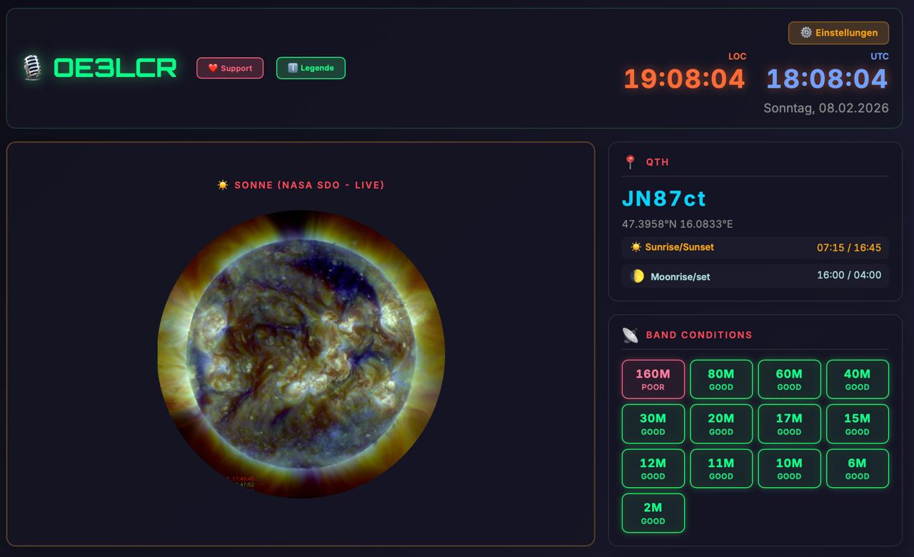

# 🎙️ HamClock - Amateur Radio Dashboard

[](https://opensource.org/licenses/MIT)
[]()
[]()
[](https://craith.cloud)
[]()

🎙️ **Professional Amateur Radio Dashboard** with real-time Sun/Moon tracking, satellite positions, band conditions, weather + space weather, and DX Cluster integration.

**✨ Live Demo:** https://craith.cloud  
**🇦🇹 QTH:** JN87ct (Vienna, Austria)  
**📡 Callsign:** OE3LCR

---

## 📸 Production Screenshot (Feb 8, 2026)



**Features:**
- ✅ Dual Time Display (LOC + UTC)
- ✅ NASA SDO Live Sun Image
- ✅ QTH Information (Sunrise/Sunset/Moonrise/Set)
- ✅ Combined Weather Box (Local + Space Weather)
- ✅ Solar Activity (K-Index, SFI, Space Weather)
- ✅ Band Conditions (13 Bands with Neon Design)
- ✅ Active Satellites (ISS, NOAA, Meteor-M, Hubble)
- ✅ DX Cluster Spots (clickable QRZ.com lookup)

---

## ✨ Core Features

### 📊 Real-Time Data
- **☀️ NASA SDO Live Image** - Solar Dynamics Observatory (15 min updates)
- **🌙 Moon Phase & Rise/Set** - Astronomical precision for your QTH
- **🛰️ Active Satellites** - ISS, NOAA-20/21, Meteor-M N2-3/4, Hubble
  - Real-time Az/El/Distance
  - 10-second Updates
  
- **🌍 DX Cluster Spots** - Interactive with QRZ.com Lookup
  - Real-time Updates (60-second)
  - Modal Popup with Band/Frequency Info

### 📡 Ham Radio Intelligence
- **📊 Band Conditions** - 13 Bands (160m to 2m)
  - Real NOAA SWPC K-Index Data
  - Neon Glow Design (GOOD=Green, FAIR=Orange, POOR=Red)
  
- **⚡ Space Weather Panel**
  - Solar Flux Index (SFI)
  - K-Index (Geomagnetic Activity)
  - Space Weather Status
  
- **🌤️ Combined Weather Box**
  - Local Weather (Open-Meteo API)
  - Temperature, Humidity, Wind Speed
  - Updates every 10 minutes

### 👤 User Settings & Personalization
- **⚙️ Setup Modal** - First-visit Configuration
  - Callsign (e.g., OE3LCR)
  - Maidenhead Locator (auto-calculated)
  - Language Selection (Deutsch / English)
  
- **💾 LocalStorage-Based** - Settings persist across sessions
- **🌐 Auto-Detect Language** - Based on browser locale
- **🎯 Dynamic QTH Personalization** - Callsign + Locator auto-calculation

### 🌍 Bilingual Interface
- **Deutsch (German)** - Austrian German (Östereichisch)
- **English** - Technical terms, callsigns, internationals
- Auto-detect from browser language
- Manual toggle via Settings

---

## 🚀 Installation

### Prerequisites
- Apache2 web server with mod_rewrite
- PHP 7.4+ with cURL support
- HTTPS enabled (Let's Encrypt)
- Brevo SMTP account (for email reports)
- ElevenLabs API key (optional, for TTS)

### Step-by-Step Setup

#### 1. Clone Repository
```bash
git clone https://github.com/RaithChr/HamClock.git
cd HamClock
```

#### 2. Copy Production Files
```bash
sudo cp -r index.html info.html js/ data/ fetch-*.php send-*.php /var/www/html/
sudo chown -R www-data:www-data /var/www/html/
sudo chmod 755 /var/www/html
```

#### 3. Create Data Directory
```bash
mkdir -p /var/www/html/data
sudo chown www-data:www-data /var/www/html/data
sudo chmod 775 /var/www/html/data
```

#### 4. Configure API Keys (.env)
Create `/var/www/html/.env` with your API keys:
```bash
# Brevo Email Service
BREVO_API_KEY=xkeysib-...
BREVO_EMAIL=your-email@domain.com
BREVO_SENDER_NAME=YourName

# ElevenLabs TTS (optional)
ELEVENLABS_API_KEY=sk_...

# Hugging Face (for image generation tools)
HUGGING_FACE_TOKEN=hf_...
```

**Note:** `.env` is protected by `.gitignore` and never pushed to GitHub.

#### 5. Setup Cron Jobs

**Solar Data Update (2x Daily - 03:00 & 15:00 UTC):**
```bash
(crontab -l 2>/dev/null; echo "0 3,15 * * * /usr/bin/php /var/www/html/fetch-solar-data.php") | crontab -
```

**Daily Email Report (22:00 UTC):**
```bash
(crontab -l 2>/dev/null; echo "0 22 * * * /usr/bin/php /var/www/html/send-daily-status-v5.php") | crontab -
```

#### 6. Verify Installation
```bash
curl https://craith.cloud
```

---

## 📁 File Structure

```
HamClock/
├── index.html                  # Main dashboard (1400+ lines)
├── info.html                   # Legende/Documentation page
├── js/
│   ├── user-settings.js        # Settings manager + modals
│   └── translations.js         # Bilingual support
├── data/
│   └── solar-data.json         # Cached NOAA solar data
├── fetch-solar-data.php        # NOAA SWPC K-Index fetcher
├── fetch-tle.php               # CelesTrak TLE fetcher
├── send-email.php              # Brevo SMTP module
├── send-daily-status-v5.php    # Daily email reports
├── README.md                   # This file
├── DEPLOY.md                   # Pre-deployment checklist
├── SECURITY_NOTE.md            # Security guidelines
├── AGENTS.md                   # Workspace templates
├── TOOLS.md                    # Tool documentation
└── screenshots/
    └── dashboard-2026-02-08.jpg
```

**NOT included (local/private):**
- `.env` - API keys (protected by .gitignore)
- `myhoney/` - Password-protected gallery
- `avatars/` - Private images
- `MEMORY.md` - Personal workspace memory
- `memory/` - Session logs

---

## 🔧 Backend Services

### fetch-solar-data.php
- **Purpose:** Fetch real-time NOAA SWPC K-Index, SFI, A-Index
- **Source:** https://services.swpc.noaa.gov/json/
- **Schedule:** Cron 2x daily (03:00 & 15:00 UTC)
- **Output:** `/var/www/html/data/solar-data.json`
- **Rate Limit:** 1 request per 5 minutes (recommended)

### send-daily-status-v5.php
- **Purpose:** Send daily email report with system metrics
- **Provider:** Brevo SMTP (300/day free tier)
- **Schedule:** Cron daily at 22:00 UTC
- **Content:** System stats, solar data, satellite info
- **Template:** HTML email with styling

### send-email.php
- **Purpose:** Brevo SMTP email module
- **API:** Brevo Transactional Email API
- **Usage:** Called by send-daily-status-v5.php
- **Required .env:** `BREVO_API_KEY`, `BREVO_EMAIL`, `BREVO_SENDER_NAME`

### fetch-tle.php
- **Purpose:** Fetch TLE data from CelesTrak
- **Source:** https://celestrak.org/
- **Schedule:** Manual or scheduled cron (3-4x daily max)
- **Note:** Rate limited - do not fetch more than 4x per day

---

## 🛡️ Security

### What's Protected
- **✅ `.env` file** - API keys (git-ignored)
- **✅ `myhoney/` gallery** - Password-protected web directory
- **✅ `avatars/` folder** - Private images (git-ignored)
- **✅ `MEMORY.md`** - Personal workspace (git-ignored)

### GitHub Safety
- ✅ Zero API keys in repository
- ✅ Zero hardcoded credentials
- ✅ `.gitignore` prevents accidental pushes
- ✅ Pre-deployment checklist (DEPLOY.md)

**See SECURITY_NOTE.md for full guidelines.**

---

## 📊 Data Sources

| Data | Source | Update |
|------|--------|--------|
| Sun Image | NASA SDO | 15 min |
| K-Index | NOAA SWPC | 5 min |
| Satellites | CelesTrak | Variable |
| Weather | Open-Meteo | 10 min |
| DX Cluster | RBN/Telnet | 60 sec |

---

## 🌐 Browser Support

- ✅ Chrome/Edge 90+
- ✅ Firefox 88+
- ✅ Safari 14+
- ✅ Mobile browsers (iOS Safari, Chrome Mobile)

---

## 📝 Configuration

### User Settings (LocalStorage)
Edit in browser via **Setup Modal** or manually:
```json
{
  "callsign": "OE3LCR",
  "locator": "JN87ct",
  "language": "de"
}
```

### Band Conditions Logic
```
K-Index < 3:  Mid/High Bands GOOD (20m, 15m, 10m)
K-Index 3-5:  Mixed propagation
K-Index > 5:  Low Bands GOOD (160m, 80m, 40m)
```

---

## 🚀 Deployment

**Before pushing to production:**
1. Run pre-deployment checklist (DEPLOY.md)
2. Verify `.env` is NOT in git
3. Test email functionality
4. Check cron job scheduling
5. Verify HTTPS certificate

See **DEPLOY.md** for comprehensive security checklist.

---

## 📧 Support & Donations

If you find this dashboard useful:

☕ **[Buy Me A Coffee](https://www.buymeacoffee.com/christianraith)**  
💳 **[PayPal](https://paypal.me/christianraith151)**

---

## 📄 License

This project is licensed under the **MIT License** - see LICENSE file for details.

---

## 🙋 Author

**Christian Raith (OE3LCR)**
- 📡 Callsign: OE3LCR
- 🇦🇹 QTH: JN87ct (Vienna, Austria)
- 🌐 Website: https://craith.cloud
- 📧 Contact: via callsign lookup

---

## 🔗 Related Resources

- **CelesTrak** - https://celestrak.org/ (Satellite TLE Data)
- **NOAA SWPC** - https://www.swpc.noaa.gov/ (Space Weather)
- **NASA SDO** - https://sdo.gsfc.nasa.gov/ (Solar Data)
- **Open-Meteo** - https://open-meteo.com/ (Weather API)
- **QRZ.com** - https://www.qrz.com/ (Operator Lookup)

---

**Version:** 1.2.0  
**Last Updated:** Feb 8, 2026  
**Status:** ✅ Production Ready
