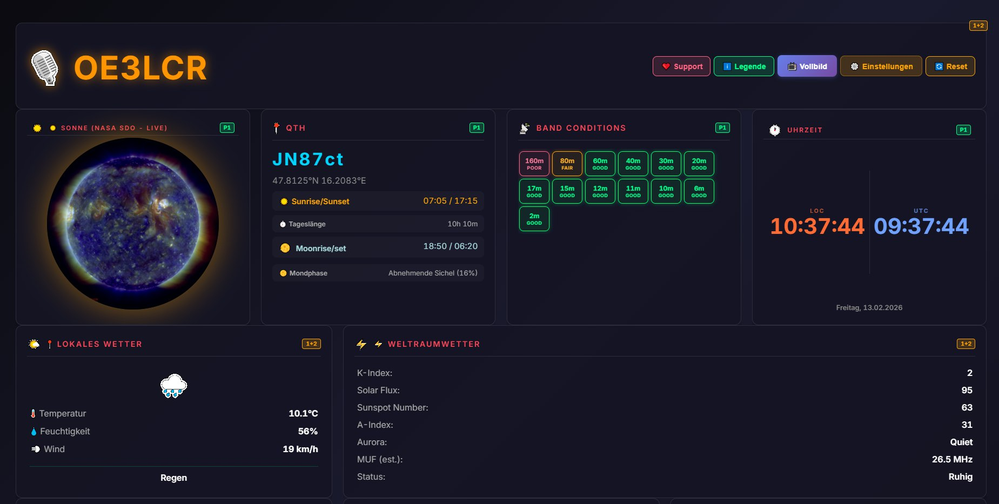
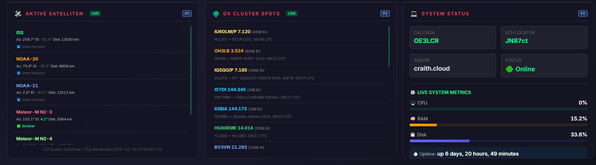

# 🎙️ HamClock – Amateur Radio Dashboard

**OE3LCR — JN87ct (Wien, Austria)**

[](LICENSE)
[](LICENSE)
[](https://craith.cloud)
[](https://php.net)
[](https://www.hamqsl.com)

Live: [https://craith.cloud](https://craith.cloud)

🎙️ **Professional Amateur Radio Dashboard** with real-time Sun/Moon tracking, satellite positions, band conditions (N0NBH/HamQSL + K-Index degradation), weather, space weather (NOAA GOES), DX Cluster, live system metrics and fullscreen kiosk mode.

---

## ☕ Support the Project

If you like this project and want to support its development:

[](https://www.buymeacoffee.com/christianraith)
[](https://paypal.me/christianraith151)

- ☕ **Buy Me a Coffee:** https://www.buymeacoffee.com/christianraith
- 💳 **PayPal:** https://paypal.me/christianraith151

Your support helps maintain and improve this project!

---

## ✨ Features

### 📡 Band Conditions (v2)
- 13 bands: 160m–2m with real N0NBH HamQSL data
- K-Index live degradation (K≥3 → GOOD→FAIR, K≥5 → storm)
- VHF (6m/2m): Aurora indicator (🌌 AUR) when K≥5
- 160m: Night/day logic (POOR daytime, follows 80m group at night)
- Tooltips with K-Index, SFI, MUF per band
- Auto-refresh every 30 minutes

### ⚡ Space Weather (extended)
- K-Index, A-Index, SFI — real N0NBH data (no random values!)
- **X-Ray class** (GOES satellite, A/B/C/M/X — colour-coded)
- **Proton Flux** (>10 MeV, pfu)
- **Electron Flux** (>2 MeV, relativistic electrons)
- **ℹ️ Legend / Legende** button: scientific DE+EN explanation of all 8 parameters
- Auto-refresh every 10 minutes

### 🌍 Other Widgets
- ☀️ Live SDO Sun image (SOHO EIT 304Å proxy)
- 📍 QTH Info: Sunrise/Sunset/Moon (USNO API)
- 🕐 Dual clock LOC/UTC
- 🌤️ Local weather (Open-Meteo)
- 🛰️ Satellites (CelesTrak TLE, 6 active)
- 🌍 DX Cluster (20 spots, live)
- 💻 System Stats (CPU/RAM/Disk, 10s refresh)

### 🖥️ Kiosk Mode
- Fullscreen auto-rotate (30s) between Page 1 & Page 2
- Badge system: P1 (green) / P2 (blue) / 1+2 (orange) per widget
- Drag & drop layout with Gridstack.js v12.4.2

---

## 🏗️ Stack

| Component | Technology |
|---|---|
| Server | Apache2 + PHP 7.4+ |
| Layout | Gridstack.js v12.4.2 |
| Band data | N0NBH HamQSL XML |
| Space weather | NOAA SWPC (GOES-16/18) |
| Solar image | SOHO NASCOM (PHP proxy) |
| Weather | Open-Meteo (free, no key) |
| Satellites | CelesTrak TLE |
| Email | Brevo SMTP (300/day free) |

---

## 📸 Screenshots (Feb 2026)

### Top Panel – Sun, QTH & Band Conditions


### Bottom Panels – Full Dashboard


---

## 📁 File Structure

```
index.php              ← Main page (Gridstack layout)
includes/              ← head.php, modals.php, footer.php
widgets/               ← header, sun, qth, bands, clock, weather-local,
                          weather-space, satellites, dx, system
css/                   ← gridstack.min.css, dashboard.css
js/                    ← gridstack.min.js, dashboard-grid.js, kiosk.js,
                          band-conditions.js, user-settings.js
data/                  ← dx-patch.php, band-patch.js, space-patch.js,
                          fetch-dx.php, fetch-space-data.php
get-sdo-image.php      ← SOHO EIT 304 proxy (5-min cache)
fetch-n0nbh.php        ← N0NBH HamQSL proxy (1h cache)
fetch-sun-moon.php     ← USNO API proxy (1h cache)
fetch-solar-data.php   ← N0NBH solar data (10min cache, no rand()!)
fetch-tle.php          ← CelesTrak TLE proxy
get-system-stats.php   ← CPU/RAM/Disk live stats
```

---

## 📄 License

This project is dual-licensed:

- **MIT License** — free to use, modify and distribute with attribution
- **Apache License 2.0** — includes patent grant and trademark protections

See [LICENSE](LICENSE) for full terms.

---

## 🔒 Security Notes

- No API keys in code — all via `.env` (never committed)
- No `rand()`-based fake data — all values from real APIs
- `.gitignore` protects: `.env`, `memory/`, `MEMORY.md`, credentials

---

*Built with ❤️ and 🍯 by OE3LCR + Gwen*
